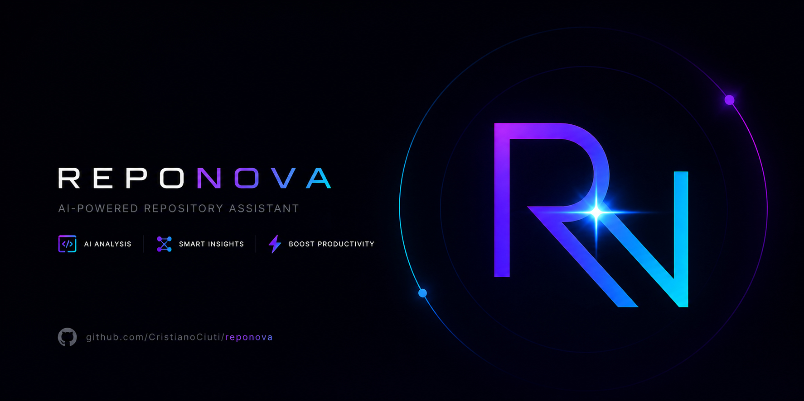

<p align="center">
  
  
  
  
  
</p>

<p align="center">
  
</p>

<h1 align="center">🤖 RepoNova 🔭</h1>

<p align="center">
  <strong>Turn your codebase into a knowledge graph. Query it with AI.</strong>
</p>

<p align="center" style="font-style: italic;">
  Knowledge graph builder &amp; <a href="https://modelcontextprotocol.io/">MCP</a> server for AI code assistants.<br/>
  Extracts symbols, relationships, and semantics from your code — then exposes the entire structure<br/>
  as 11 graph tools that any MCP-compatible agent can use.
</p>

---

> **⚠️ Alpha — Active Development**
> APIs, config format, and CLI may change between releases.
> Already usable in production workflows. [Open an issue](https://github.com/CristianoCiuti/reponova/issues) if something doesn't work.

---

## Why RepoNova?

AI agents read files one at a time. They don't understand how your codebase fits together — which functions call what, which modules depend on which, where the architectural bottlenecks are.

**RepoNova fixes that.** It builds a persistent knowledge graph of your entire codebase (or multiple repos) and gives your AI agent 11 specialized tools to query it: search, impact analysis, shortest path, semantic similarity, community detection, and more.

> **One build. Persistent graph. Instant queries across sessions.**
> No re-reading files. No burning tokens on context. The graph remembers everything.

### What makes it different

- **Zero external dependencies** — no Python, no Docker, no database servers. Pure Node.js
- **Multi-repo support** — build one graph spanning multiple repositories
- **Smart incremental builds** — SHA256 file hashing, per-phase config change detection
- **Intelligent enrichment** — your AI agent or a configured LLM provider generates architectural descriptions, community profiles, and routing decisions
- **11 MCP tools** — from text search to weighted Dijkstra, semantic similarity to structural queries
- **Works with any AI coding agent** — OpenCode, Cursor, Claude Code, VS Code Copilot

---

## How it works

```
  Your Codebase                      /reponova-enrich                             AI Agent
  ─────────────                      ────────────────                             ────────

  Source Code          ──────────►   1. tree-sitter AST parsing                   graph_search
  Markdown / Docs                    2. Symbol + edge extraction        ──────►   graph_impact
  Diagrams (plugins)                 3. Louvain communities                       graph_path
  Multi-repo                         4. Enrichment (summaries + descriptions)     graph_similar
                                     5. TF-IDF / ONNX / API embeddings
                                     6. HTML visualizations                       ... (11 tools)
```

Language support is provided via plugins, only Markdown is built-in. See [Contributing](#contributing) for how to create a language plugin.

---

## Quick Start

### 1. Install into your editor

```bash
reponova install --target opencode
```

Supported targets: `opencode`, `cursor`, `claude`, `vscode`

Artifacts installed per editor:

| Editor | MCP Config | Hook / Plugin | MCP Skill | Enrich Command | Config |
|--------|-----------|---------------|-----------|----------------|--------|
| OpenCode | `.opencode/opencode.json` | `.opencode/plugins/reponova.js` | `.opencode/skills/reponova-mcp/SKILL.md` | `.opencode/commands/reponova-enrich.md` | `.opencode/reponova.yml` |
| Cursor | `.cursor/mcp.json` | `.cursor/rules/reponova-mcp.mdc` | *(embedded in rule)* | `.cursor/commands/reponova-enrich.md` | `.cursor/reponova.yml` |
| Claude Code | `claude mcp add` (manual) | `.claude/settings.json` (PreToolUse) | `.claude/skills/reponova-mcp/SKILL.md` | `.claude/skills/reponova-enrich/SKILL.md` | `.claude/reponova.yml` |
| VS Code | `.vscode/mcp.json` | *(skill auto-loads)* | `.github/skills/reponova-mcp/SKILL.md` | `.github/skills/reponova-enrich/SKILL.md` | `.vscode/reponova.yml` |

### 2. Build and enrich the graph

Type `/reponova-enrich` in your editor. This single command handles the entire pipeline:

- Builds the structural graph (file detection, AST parsing, community detection)
- Generates architectural node descriptions
- Profiles communities with meaningful labels
- Routes misplaced nodes to correct communities
- Proposes and applies structural merges/splits
- Runs downstream phases (search index, embeddings, HTML visualizations)

Your AI agent acts as the reasoning engine — no API keys, no local models, no downloads.

> **Headless alternative:** Run `reponova build` from the CLI for a fully algorithmic build (no LLM). For automated LLM enrichment, configure `enrich.provider` in `reponova.yml` — then `reponova build` handles everything including intelligent enrichment.

### 3. Use it

The MCP server starts automatically. Your AI agent now has 11 graph tools.

```
You: "What would be the impact of refactoring the authenticate function?"
Agent: [calls graph_impact] → shows upstream/downstream blast radius across repos
```

### Keeping the graph fresh

After code changes, re-run `/reponova-enrich` — only changed files are re-parsed, only affected steps re-run.

For CI or headless environments: `reponova build` (incremental by default, `--force` for full rebuild).

---

## MCP Tools

11 specialized tools exposed over MCP (stdio):

| Tool | Description |
|------|-------------|
| `graph_search` | 🔍 Full-text search across nodes. Filter by type, repo. Expand results with BFS/DFS. |
| `graph_impact` | 💥 Blast radius analysis — find all upstream/downstream dependents of any symbol. |
| `graph_path` | 🛤️ Weighted shortest path (Dijkstra) between two symbols. Filter by edge type. |
| `graph_explain` | 📋 Full detail on a node: edges, community, centrality metrics, signature, docstring. |
| `graph_similar` | 🧲 Semantic similarity search using vector embeddings (TF-IDF, ONNX, or remote provider). |
| `graph_context` | 🧠 Smart context builder with token budget — combines search + vectors + graph expansion. |
| `graph_community` | 🏘️ List all nodes in a community, ranked by degree centrality. |
| `graph_hotspots` | 🔥 God nodes / architectural bottlenecks — most connected symbols in the graph. |
| `graph_outline` | 🗂️ Tree-sitter code outline: functions, classes, imports with signatures and line ranges. |
| `graph_docs` | 📄 Search documentation nodes (markdown, text, rst). |
| `graph_status` | 📊 Graph metadata: node/edge counts, repos, build timestamp, version. |

---

## Enrichment

RepoNova supports two enrichment modes:

| Mode | How it works | Requires |
|------|-------------|----------|
| **Agent-driven** | `/reponova-enrich` — your AI agent builds the graph AND acts as the reasoning engine for enrichment. Complete pipeline in one command. | Any AI coding agent |
| **Automated** | `reponova build` with `enrich.provider` configured — an external LLM generates descriptions, profiles, and routing decisions during the build. | A configured LLM provider in `reponova.yml` |

### What enrichment does

The enrichment pipeline (7 steps) transforms a raw structural graph into an architecturally-aware knowledge base:

| Step | What |
|------|------|
| 0 | Classify boundary nodes (candidates for rerouting) + compute edge density |
| 1 | Generate architectural descriptions for high-degree nodes |
| 2 | Profile each community (label, purpose, misfits) |
| 3 | Route misfit nodes to better communities based on profiles |
| 4 | Detect merge/split opportunities across communities |
| 5 | Apply routing + restructure mutations to the graph |
| 6 | Re-profile affected communities |
| 7 | Finalize output files (`graph-enriched.json`, `node_descriptions.json`, `community_summaries.json`) |

### Agent-driven enrichment (`/reponova-enrich`)

The installed command guides the agent through the full pipeline:

```
You: /reponova-enrich
Agent: [builds structural graph]
       [reads input batches, reasons about architecture, writes output batches]
       [CLI merges results, applies mutations]
       [runs downstream phases: search index, embeddings, HTML]
```

The agent uses `reponova enrich:*` subcommands for batch preparation and merging. All reasoning (descriptions, profiles, routing decisions) comes from the agent itself.

---

## CLI Reference

### `reponova install`

Set up editor integration (MCP server, plugin/hook, skills, enrich command, config).

```bash
reponova install --target <editor> [--graph <path>]
```

| Option | Required | Description |
|--------|----------|-------------|
| `--target` | Yes | `opencode`, `cursor`, `claude`, `vscode` |
| `--graph` | No | Path to output directory. Default: `./reponova-out` |

### `reponova build`

Run the full build pipeline (incremental by default).

```bash
reponova build [--config <path>] [--force] [--target <phase,...>] [--start-after <phase>] [--check <phase>]
```

| Option | Required | Description |
|--------|----------|-------------|
| `--config` | No | Path to `reponova.yml` (default: auto-detected) |
| `--force` | No | Ignore all caches and rerun every phase |
| `--target` | No | Run only these phases and their dependencies (comma-separated, e.g. `communities,outlines`) |
| `--start-after` | No | Run only phases downstream of this phase |
| `--check` | No | Check if a phase needs to run (exit 0 = up to date, exit 1 = needs run) |

**Build pipeline (9 DAG phases, 5 levels):**

```
Level 0: file-detection
Level 1: graph, outlines                         (parallel)
Level 2: communities
Level 3: enrich
Level 4: search-index, embeddings, html, report  (parallel)
```

| Phase | What it does |
|-------|-------------|
| **file-detection** | Discover files by registered type (built-in docs + plugin extensions) |
| **graph** | Parse with tree-sitter, extract symbols/calls/imports/inheritance, build graph |
| **outlines** | Generate tree-sitter code outlines per file (SHA256 hashing — skip unchanged) |
| **communities** | Louvain community detection, write `graph.json` |
| **enrich** | Generate `graph-enriched.json`, community summaries, node descriptions (algorithmic or LLM) |
| **search-index** | SQLite search index (`graph_search.db`) |
| **embeddings** | Incremental embeddings (TF-IDF, ONNX, or remote provider) |
| **html** | Interactive visualizations (`graph.html`, `graph_communities.html`) |
| **report** | Build report with stats, hotspots, community breakdown |

### `reponova enrich`

Run the intelligent enrichment pipeline with a configured LLM provider. Builds up to `communities` if needed, runs all enrichment steps, seals the cache.

```bash
reponova enrich [--config <path>]
```

| Option | Required | Description |
|--------|----------|-------------|
| `--config` | No | Path to `reponova.yml` (default: auto-detected) |

> **Note:** Does NOT run downstream phases (search-index, embeddings, html, report). Run `reponova build --start-after enrich` afterwards to complete the pipeline.

### `reponova enrich:*`

Step-by-step enrichment subcommands for IDE/agent workflows.

```bash
reponova enrich:metrics                        # Step 0: candidates + edge density
reponova enrich:prepare <step>                 # Prepare input batches
reponova enrich:merge <step>                   # Merge output batches
reponova enrich:apply                          # Step 5: apply routing + restructure
reponova enrich:finalize                       # Step 7: produce final output files
```

| Step | What it produces |
|------|-----------------|
| `descriptions` | Architectural descriptions for high-degree nodes |
| `profiles` | Community profiles (label, purpose, misfits) |
| `routing` | Routing decisions for boundary candidates |
| `restructure` | Merge/split proposals across communities |
| `updated-profiles` | Re-profiled communities after mutations |

| Option | Required | Description |
|--------|----------|-------------|
| `--config` | No | Path to `reponova.yml` (default: auto-detected) |

### `reponova mcp`

Start the MCP server (stdio transport). Normally launched automatically by the editor.

```bash
reponova mcp [--graph <path>]
```

| Option | Required | Description |
|--------|----------|-------------|
| `--graph` | No | Path to output directory. Default: `./reponova-out` |

### `reponova check`

Health check for graph artifacts, search index, outlines, tree-sitter runtime, and declared language plugins. Exits `1` if anything is missing — declared-but-not-installed plugins are listed with the exact `lang add` command to fix them.

```bash
reponova check [--config <path>] [--graph <path>]
```

| Option | Required | Description |
|--------|----------|-------------|
| `--config` | No | Path to `reponova.yml` (default: auto-detected) |
| `--graph` | No | Path to output directory. Default: `./reponova-out` |

### `reponova lang`

Manage language plugins. The package manager (`npm` / `pnpm` / `yarn` / `bun`) and install scope (global / local / linked) are detected automatically.

```bash
reponova lang <subcommand> [args] [flags]
```

| Subcommand | Description |
|------------|-------------|
| `add <package>` | Install a language plugin and declare it in `reponova.yml` |
| `remove <id>` | Remove a plugin from `reponova.yml` and uninstall its package |
| `list` | List declared plugins with their load status |
| `suggest` | Scan repos, find used file extensions, propose matching plugins (interactive) |

| Flag | Applies to | Description |
|------|-----------|-------------|
| `--config-only` | `remove` | Only update `reponova.yml`, keep the package installed |
| `--purge-global` | `remove` | In global context, uninstall without confirmation prompt |
| `--dry-run` | `suggest` | Print the report only, skip the interactive prompt |
| `--yes` | `suggest` | Install all suggestions without prompting (CI mode) |

By default, `remove` on a globally-installed reponova prompts before touching the system-wide package (and skips it with a warning in non-interactive shells). `suggest` queries the public npm registry for `@reponova/lang-*` plus any community plugin tagged `reponova-plugin` / `reponova-language`.

### `reponova cache`

Inspect and manage per-phase cache state. Exactly one operation is required. Phases are the same as in [`reponova build`](#reponova-build).

```bash
reponova cache --status                        # Show cache status for all phases
reponova cache --check <phase>                 # Check if fresh (exit 0 = fresh, exit 1 = stale)
reponova cache --seal <phase>                  # Manually seal (marks as up-to-date)
reponova cache --invalidate <phase>            # Invalidate (forces re-run on next build)
```

| Option | Required | Description |
|--------|----------|-------------|
| `--config` | No | Path to `reponova.yml` (default: auto-detected) |

### `reponova models`

Manage local AI models (ONNX embeddings, GGUF LLM weights).

```bash
reponova models <subcommand>
```

| Subcommand | Description |
|------------|-------------|
| `status` | Show configured and cached models |
| `download` | Pre-download all models needed by config |
| `remove <name>` | Remove a specific cached model |
| `clear` | Remove all cached models |

---

## Supported Languages

RepoNova uses a plugin system for language support. Only Markdown is built-in; everything else is provided by external plugin packages (see [Contributing](#contributing) for how to create one).

### Built-in

| Language | Extensions | Parser | Symbols Extracted |
|----------|-----------|--------|-------------------|
| Markdown | `.md`, `.txt`, `.rst` | Regex | Documents, sections (as containment hierarchy) |

### Available Plugins

All official plugins are developed in the [`reponova-langs`](https://github.com/CristianoCiuti/reponova-langs) monorepo and published to npm under the `@reponova/lang-*` scope. Install with `reponova lang add <package>`:

| Plugin | Package | Extensions | What it extracts |
|--------|---------|-----------|------------------|
| Python | [`@reponova/lang-python`](https://www.npmjs.com/package/@reponova/lang-python) | `.py`, `.pyw` | Functions, classes, methods, decorators, docstrings, top-level constants, `TypeVar` / `NewType` / type aliases, imports (incl. `TYPE_CHECKING` and aliased), heritage (incl. generics), calls, `__all__` exports. Tree-sitter AST outlines. |
| JavaScript | [`@reponova/lang-javascript`](https://www.npmjs.com/package/@reponova/lang-javascript) | `.js`, `.mjs`, `.cjs`, `.jsx` | Functions, classes, methods, arrow-function components, class fields / getters / setters, decorators (`async` / `generator` / `static`), JSDoc docstrings, ES `import` + CommonJS `require`, calls (incl. JSX components and React hooks), `extends` heritage. Tree-sitter AST outlines. |
| TypeScript | [`@reponova/lang-typescript`](https://www.npmjs.com/package/@reponova/lang-typescript) | `.ts`, `.mts`, `.cts` | Functions, classes (incl. `abstract`), methods, interfaces, type aliases, enums, namespaces / modules, class fields with full modifier markers, getters / setters, exported `const` bindings, JSDoc docstrings, imports, `extends` / `implements` heritage, calls. Tree-sitter AST outlines. |
| TSX | [`@reponova/lang-tsx`](https://www.npmjs.com/package/@reponova/lang-tsx) | `.tsx` | Same shape as `lang-typescript` against the JSX-aware grammar. Captures React functional components, JSX-element calls, hooks, plus all TS symbols (interfaces, type aliases, enums, namespaces, …). Tree-sitter AST outlines. |
| JSON / JSONC | [`@reponova/lang-json`](https://www.npmjs.com/package/@reponova/lang-json) | `.json`, `.jsonc` | Schema-aware extraction for canonical JS/TS configs: `package.json` (name, `scripts.*`, `bin`, dependencies as imports), `tsconfig*.json` (`extends`, `references[].path`, `compilerOptions.paths` aliases), `nx.json` and `project.json` (targets, `namedInputs`, tags, `implicitDependencies`), `turbo.json` (`pipeline.*` / `tasks.*`), npm / `lerna.json` workspaces. Generic JSON / JSONC fallback surfaces top-level keys (capped via `maxGenericKeys`). Uses `jsonc-parser` — supports trailing commas and `//` / `/* */` comments. |
| PlantUML | [`@reponova/lang-plantuml`](https://www.npmjs.com/package/@reponova/lang-plantuml) | `.puml`, `.plantuml` | Classes / interfaces / enums, sequence-diagram participants (actor, boundary, control, entity, …), state diagrams (incl. implicit states), components / deployment nodes, C4-DSL macros (`Person`, `System`, `Container`, `Component`, …), relationships (extends, association, aggregation, composition). |
| SVG | [`@reponova/lang-svg`](https://www.npmjs.com/package/@reponova/lang-svg) | `.svg` | File `<title>` as docstring, plus up to 20 labels per file from `<text>` / `<title>` / `<desc>` / `aria-label` (essential for path-only icon SVGs). Source kind preserved per symbol. Useful for design assets, hand-authored diagrams, icon libraries, rendered Mermaid / PlantUML output. |

```bash
reponova lang suggest                         # scan repos + propose plugins (interactive)
reponova lang add @reponova/lang-python
reponova lang add @reponova/lang-typescript
reponova lang add @reponova/lang-tsx
reponova lang add @exampleorg/lang-rust       # community plugins work too
reponova lang list                            # show declared plugins
reponova lang remove svg                      # uninstall by plugin id
```

See the [`reponova lang`](#reponova-lang) reference for the full subcommand and flag list.

### Edge Types

| Edge Type | Description |
|-----------|-------------|
| `calls` | Function/method invocation |
| `imports` | Module-level import |
| `imports_from` | Named import of a specific symbol |
| `extends` | Class inheritance |
| `contains` | Parent contains child (module→symbol, class→method, document→section) |

---

## Configuration

### Config Resolution

Auto-detected from (first match wins):

1. `--config` argument
2. `reponova.yml` in project root
3. `.opencode/reponova.yml`
4. `.cursor/reponova.yml`
5. `.claude/reponova.yml`
6. `.vscode/reponova.yml`

All paths are **relative to the config file's location**.

### Full Config Reference

```yaml
# ──────────────────────────────────────────────────────────────────────────────
# reponova.yml — Full Configuration Reference
# ──────────────────────────────────────────────────────────────────────────────

# Where to write build output
# Default: "reponova-out"
output: ../reponova-out

# ── Repositories ──────────────────────────────────────────────────────────────
repos:
  - name: api-service           # unique identifier
    path: ../services/api       # path relative to this file
  - name: core-lib
    path: ../services/core

# ── Providers (optional — AI backends) ────────────────────────────────────────
# Default (no provider) = fully algorithmic. No downloads, no API keys.
providers:
  my-openai:
    type: openai                  # "openai" | "llama-cpp" | "onnx"
    base_url: https://api.openai.com/v1
    model: text-embedding-3-small
    api_key: ${OPENAI_API_KEY}    # env var (resolved at runtime)
    timeout: 30                   # seconds (default: 30)
  local-llm:
    type: llama-cpp
    model: "hf:Qwen/Qwen2.5-0.5B-Instruct-GGUF:Q4_K_M"
    context_size: 512
  local-embeddings:
    type: onnx
    model: all-MiniLM-L6-v2
  ollama:
    type: openai
    base_url: http://localhost:11434/v1
    model: nomic-embed-text

# ── Model Management ─────────────────────────────────────────────────────────
models:
  cache_dir: ~/.cache/reponova/models   # default
  gpu: auto                             # "auto" | "cpu" | "cuda" | "metal" | "vulkan"
  threads: 0                            # 0 = auto-detect
  download_on_first_use: true

# ── Source Code Filters ───────────────────────────────────────────────────────
patterns: []                    # empty = auto-detect by extension
exclude: []                     # e.g. ["**/generated/**", "**/*.test.ts"]
exclude_common: true            # skip node_modules, __pycache__, .git, venv, dist, build, ...
incremental: true               # SHA256 file hashing — only re-parse changed files

# ── Documentation ─────────────────────────────────────────────────────────────
docs:
  enabled: true
  patterns: []                  # empty = auto-detect (.md, .txt, .rst)
  exclude: []
  max_file_size_kb: 500

# ── Language Plugins ──────────────────────────────────────────────────────────
# Declare plugins here. Installed via `reponova lang add <package>`.
# If `package` is omitted, resolved as @reponova/lang-<key>.
plugins:
  python:                          # shorthand → @reponova/lang-python
    enabled: true
  rust:                            # community plugin → explicit package
    package: "@exampleorg/lang-rust"
    enabled: true
  plantuml:
    enabled: true
    parse: true                    # plugin-specific option

# ── Embeddings ────────────────────────────────────────────────────────────────
# Default: TF-IDF (fast, no download). Set provider for ONNX or remote embeddings.
embeddings:
  enabled: true
  provider: my-openai              # enables llm embeddings
  batch_size: 128

# ── Enrich ────────────────────────────────────────────────────────────────────
# Default (no provider): algorithmic (rule-based summaries + descriptions)
# With provider: intelligent multi-step LLM enrichment pipeline
enrich:
  enabled: true
  provider: local-llm             # enables intelligent enrichment
  threshold: 0.8                  # top 20% of nodes by degree get descriptions
  max_communities: 0              # 0 = no limit
  candidate_threshold: 0.3        # boundary ratio for routing candidates
  description_batch_tokens: 40000 # token budget per description batch
  routing_batch_size: 30
  concurrency: 4                  # max parallel LLM calls
  max_retry_depth: 3
  max_tokens:                     # per-step LLM output token limits
    descriptions: 32768
    profiles: 2048
    routing: 8192
    restructure: 4096
  profile:                        # community profile prompt limits
    max_nodes: 80
    max_edges: 50
  restructure_max_pairs: 20       # max cross-community pairs for merge/split analysis

# ── HTML ──────────────────────────────────────────────────────────────────────
html: true
# html_min_degree: 3

# ── Outlines ──────────────────────────────────────────────────────────────────
outlines:
  enabled: true

# ── Server ────────────────────────────────────────────────────────────────────
server: {}
```

### Config Examples

**Minimal (single repo, algorithmic):**
```yaml
output: ../reponova-out
repos:
  - name: my-project
    path: ..
```

**Multi-repo:**
```yaml
output: ../reponova-out
repos:
  - name: api
    path: ../services/api
  - name: core
    path: ../services/core
```

**With LLM provider (automated enrichment via `reponova build`):**
```yaml
output: ../reponova-out
repos:
  - name: my-project
    path: ..
providers:
  local-llm:
    type: openai
    base_url: http://localhost:11434/v1
    model: llama3.2
enrich:
  provider: local-llm
```

---

## Models & Providers

By default, everything is algorithmic — no downloads, no API keys. Providers enable richer AI features.

| Type | Purpose | Size | Requires |
|------|---------|------|----------|
| `onnx` | Local embeddings (sentence-transformers) | ~86 MB | Nothing (bundled runtime) |
| `llama-cpp` | Local LLM (GGUF) for enrichment | ~350 MB | `node-llama-cpp` (optional peer dep) |
| `openai` | Remote OpenAI-compatible API | None | API key or local server (Ollama, LM Studio, etc.) |

**Retry policy:** Embeddings — 3 retries with exponential backoff on HTTP 429. Enrichment — configurable via `enrich.max_retry_depth` (default 3).

---

## Build Output

After building the graph, the output directory contains:

```
reponova-out/
├── graph.json                    # Full graph: nodes, edges, community assignments
├── graph-enriched.json           # Enriched graph (after intelligent enrichment)
├── graph-nodes.json              # Intermediate (pre-community detection)
├── detected-files.json           # Detected file list
├── graph.html                    # Interactive visualization (vis.js)
├── graph_communities.html        # Community-focused visualization
├── graph_search.db               # SQLite search index
├── report.md                     # Build report: stats, hotspots, communities
├── community_summaries.json      # Community summaries
├── node_descriptions.json        # Node descriptions
├── tfidf_idf.json                # TF-IDF vocabulary weights
├── vectors/                      # LanceDB vector store
├── outlines/                     # Code outlines per file
├── .enrich/                      # Enrichment intermediates (intelligent mode)
│   ├── candidates.json           #   boundary node classification
│   ├── edge-density.json         #   inter-community density
│   ├── descriptions.json         #   merged descriptions
│   ├── profiles.json             #   merged community profiles
│   ├── routing.json              #   merged routing decisions
│   ├── restructure.json          #   merge/split proposals
│   ├── graph-applied.json        #   graph after mutations
│   └── updated-profiles.json     #   re-profiled communities
└── .cache/                       # Incremental build cache
```

---

## Programmatic API

### Build

```typescript
import { build } from "reponova";

const result = await build("./reponova.yml");
// result.outputDir, result.phases, result.totalProcessed
```

### Runtime Registration + Build

```typescript
import { build, registerExtractor, registerOutlineLanguage } from "reponova";
import type { LanguageExtractor, LanguageSupport } from "reponova";

registerExtractor(myExtractor);
registerOutlineLanguage("rust", ["rs"], myOutline);
const result = await build("./reponova.yml");
```

### Query

```typescript
import {
  openDatabase, initializeSchema, populateDatabase,
  loadGraphData, searchNodes, analyzeImpact, findShortestPath,
} from "reponova";

const graphData = loadGraphData("./reponova-out/graph.json");
const db = await openDatabase(":memory:");
initializeSchema(db);
populateDatabase(db, graphData);

const results = searchNodes(db, "authentication", { top_k: 5, type: "function" });
const impact = analyzeImpact(db, "Function:authenticate_user", { max_depth: 3 });
const path = findShortestPath(db, graphData, "ModuleA", "ModuleB");
```

### Smart Context

```typescript
import { ContextBuilder, loadConfig } from "reponova";

const { config } = loadConfig("./reponova.yml");
const builder = new ContextBuilder(db, graphData, "./reponova-out");
await builder.initialize(config.embeddings);
const context = await builder.buildContext({ query: "authentication flow", maxTokens: 4000 });
```

---

## FAQ

### Do I need an API key?

No. By default, RepoNova is fully algorithmic. For agent-driven enrichment (`/reponova-enrich`), the agent's own reasoning is the "model" — no external services needed. API keys are only needed if you configure a remote `openai` provider.

### How long does a build take?

Algorithmic mode (no LLM):
- Small (500 files): ~5-10s
- Medium (5,000 files): ~30-60s
- Large monorepo (20,000+ files): 2-5 min

Intelligent enrichment adds 1-10 minutes depending on graph size, LLM speed, and concurrency.

### Can I use it without an editor?

Yes. `reponova build` and the programmatic API work standalone. The MCP server is just one way to query the graph.

---

## Contributing

### Adding Language Support (Plugin)

**Any npm package can be a RepoNova language plugin**. Community plugins like `@exampleorg/lang-rust` or `reponova-lang-kotlin` work exactly like official ones.

#### Requirements for a valid language plugin

A package is a valid RepoNova language plugin when it meets **all** of these criteria:

1. **`package.json`** contains `"reponova": { "type": "language" }`
2. **Entry point** exports a `plugin` (or `default`) object conforming to `LanguagePlugin`
3. **`plugin.id`** is a unique string identifier (e.g. `"rust"`, `"kotlin"`)
4. **`plugin.extensions`** is a non-empty array of file extensions (e.g. `[".rs"]`)
5. **`plugin.extractor`** is a valid `LanguageExtractor` implementation

Optional but recommended:
- `plugin.grammarPath` — tree-sitter WASM grammar for AST-based parsing
- `plugin.outline` — `LanguageSupport` implementation for `graph_outline` tool
- `plugin.fileType` — category label in output (defaults to `id`)
- `plugin.configDefaults` — default values for plugin-specific config options

#### Creating a new language plugin

1. **Create a new npm package** (any name, any scope)
2. **Add** `"reponova": { "type": "language" }` to `package.json`
3. **Export** a `plugin` object conforming to `LanguagePlugin`
4. **Optionally** include a tree-sitter WASM grammar in `grammars/`
5. **Publish** to npm (or use locally via `npm link`)

Users install it with:
```bash
reponova lang add @exampleorg/lang-rust
```

This installs the package and declares it in `reponova.yml`:
```yaml
plugins:
  rust:
    package: "@exampleorg/lang-rust"
    enabled: true
```

#### `LanguagePlugin` Interface

```typescript
interface LanguagePlugin {
  readonly id: string;              // e.g. "python", "plantuml"
  readonly extensions: string[];    // e.g. [".py", ".pyw"]
  readonly fileType?: string;       // category label in detected-files.json (default: id)
  readonly grammarPath?: string;    // absolute path to tree-sitter WASM grammar
  readonly extractor: LanguageExtractor;
  readonly outline?: LanguageSupport;
  readonly configDefaults?: Record<string, unknown>;  // default plugin config values
}
```

#### `LanguageExtractor` Interface

```typescript
interface LanguageExtractor {
  readonly languageId: string;
  readonly extensions: string[];
  readonly wasmFile?: string;
  extract(tree: SyntaxTree | null, sourceCode: string, filePath: string): FileExtraction;
  resolveImportPath(importModule: string, currentFilePath: string): string[];
}
```

#### `FileExtraction` Return Type

```typescript
interface FileExtraction {
  filePath: string;
  language: string;
  symbols: SymbolNode[];
  imports: ImportDeclaration[];
  references: SymbolReference[];
}
```

| Type | Key Fields | Purpose |
|------|-----------|---------|
| `SymbolNode` | `name`, `qualifiedName`, `kind`, `signature?`, `decorators`, `docstring?`, `startLine`, `endLine`, `parent?`, `bases?`, `calls` | A symbol in the file |
| `ImportDeclaration` | `module`, `names`, `isWildcard`, `isExport?`, `line` | An import/export statement |
| `SymbolReference` | `name`, `fromSymbol`, `kind`, `line` | A reference to another symbol |
| `SymbolKind` | `"function"` \| `"class"` \| `"method"` \| `"variable"` \| `"constant"` \| `"interface"` \| `"enum"` \| `"module"` \| `"document"` \| `"section"` | Symbol classification |

See `src/extract/types.ts` for full definitions.

#### Example: Official plugin (`@reponova/lang-python`)

```typescript
import type { LanguagePlugin } from "reponova";
import { PythonExtractor } from "./extractor.js";
import { python as pythonOutline } from "./outline.js";
import { resolve } from "node:path";
import { fileURLToPath } from "node:url";

const grammarPath = resolve(fileURLToPath(new URL(".", import.meta.url)), "../grammars/tree-sitter-python.wasm");

export const plugin: LanguagePlugin = {
  id: "python",
  extensions: [".py", ".pyw"],
  fileType: "python",
  grammarPath,
  extractor: new PythonExtractor(),
  outline: pythonOutline,
};
```

#### Example: Minimal community plugin

```typescript
import type { LanguagePlugin } from "reponova";
import { RustExtractor } from "./extractor.js";

export const plugin: LanguagePlugin = {
  id: "rust",
  extensions: [".rs"],
  fileType: "rust",
  extractor: new RustExtractor(),
};
```

#### Plugin `package.json`

```json
{
  "name": "@exampleorg/lang-rust",
  "version": "1.0.0",
  "type": "module",
  "exports": { ".": "./dist/index.js" },
  "peerDependencies": { "reponova": ">=0.4.0" },
  "reponova": { "type": "language" }
}
```

#### Plugin config

Users configure plugins in `reponova.yml` under the `plugins:` key:

```yaml
plugins:
  rust:
    package: "@exampleorg/lang-rust"
    enabled: true
    exclude: ["**/target/**"]
```

If the package follows the `@reponova/lang-<id>` convention, the `package` field can be omitted:

```yaml
plugins:
  python:
    enabled: true       # resolves to @reponova/lang-python
```

Common properties (all optional): `package`, `enabled` (default: true), `patterns`, `exclude`.
Custom properties are defined by the plugin via `configDefaults`.

### Adding Outline Support

Outlines (`graph_outline`) are provided by plugins alongside extraction. A plugin exports an optional `outline` field implementing `LanguageSupport`:

```typescript
interface LanguageSupport {
  readonly wasmFile: string;
  treeSitterExtract(rootNode: SyntaxNode, filePath: string, lineCount: number): FileOutline;
  regexExtract(filePath: string, source: string, lineCount: number): FileOutline;
}
```

Reference implementations live in the [`reponova-langs`](https://github.com/CristianoCiuti/reponova-langs) monorepo — e.g. [`packages/lang-python`](https://github.com/CristianoCiuti/reponova-langs/tree/main/packages/lang-python) (regex + tree-sitter outline) and [`packages/lang-typescript`](https://github.com/CristianoCiuti/reponova-langs/tree/main/packages/lang-typescript) (shared core reused by `lang-tsx` and `lang-javascript`).

---

## License

MIT — [CristianoCiuti/reponova](https://github.com/CristianoCiuti/reponova)
